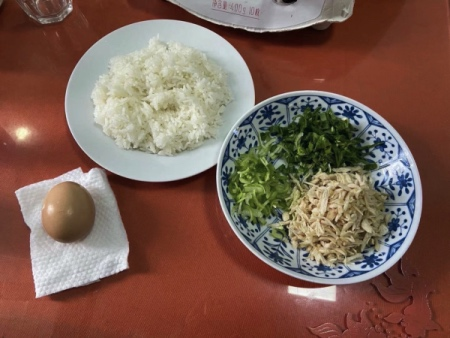
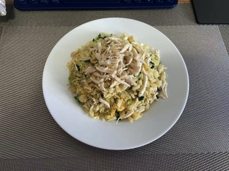

## 一人食 —— 青（菜）（鸡）丝黄金蛋炒饭

### 版本一

#### 食材：
- 鸡肉，选用的是鸡胸肉
- 青菜🥬
- 鸡蛋
- 米饭
- 蒜瓣
- 黑胡椒，选用的是可以现磨的瓶装的黑胡椒粒
- 盐
- 鸡精

#### 预处理：
- 将`鸡肉`煮熟后撕成丝状待用；
- 将`青菜`洗净后将茎和叶分开，即切下茎块，然后将茎切成小薄块，将叶切成条状，分开放置待用；
- 将`蒜瓣`压扁，切成丁末状，盛盘待用；
- 开始预处理`鸡丝`，待锅中油热后，先放入`蒜末`稍微煸炒几下，不要炒出糊味，再加入`鸡丝`翻炒，因为鸡肉本已是煮熟，所以翻炒至颜色稍微变深即可，最后加入少量黑胡椒未盛盘。
- 鸡蛋打至碗中，搅均后待用。

#### 开始制作：
- 热锅，加入少量的油，倒入`米饭`，炒至米饭松散，最好是米饭原始的颗粒状；
- 加入搅均的`鸡蛋`，此时小幅度的前后方向颠锅，同时用锅铲按时钟方向搅拌，重复这样的动作，待米饭和鸡蛋液充分混合停止，一直翻炒待米饭变至金黄后进行下一步；
- 先加入`菜茎`，然后继续翻炒；
- 加入部分之前预处理的`鸡丝`翻炒，剩下的鸡丝留着最后盛盘时盖在最上面，提升视觉感；
- 加入`菜叶`，翻炒至叶子缩小变软后，开始添加最后的调味料，按照自己的口味加入少许`盐`，翻均后，再加入少量的`鸡精`，同样是翻均，保证调味料都溶入米饭后关火盛盘。

#### 成果分享

#### 总结
炒饭的口感偏硬，如果再配一碗汤就更好了。
