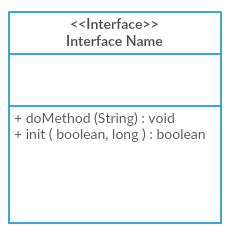
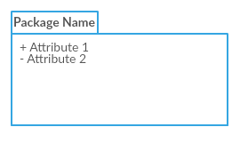
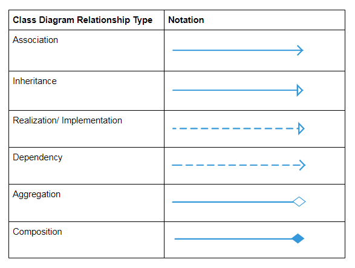

## The Easy Guide to UML Class Diagrams | Class Diagram Tutorial

> ### UML类图简易指导｜ 类图教程

 

### [原文链接](https://creately.com/blog/diagrams/class-diagram-tutorial)
 

At the heart of any object-oriented system is the step of designing the class structure - therefore the saying goes that class diagrams are the most popular out the UML diagram types.

> 对于任何面向对象编程的系统，其核心的一步是设计类图 — 因此存在这么一种说法是类图是UML各类图中最流行的。

In this easy class diagram tutorial, we've covered the key areas you need to know to draw class diagrams without a struggle, Scroll down to find out.

> 在这篇简易类图教程中，我们覆盖了不会艰难地进行画类图你需要知道的一些关键的领域，鼠标向下滚动去查看。

 

  - [Class Diagram Definition | What is a Class Diagram?](#class-diagram-definition--what-is-a-class-diagram)
  - [Class Diagram Notations with Examples](#class-diagram-notations-with-examples)
  - [How to Draw a Class Diagram](#how-to-draw-a-class-diagram)
  - [Class Diagram Best Practices](#class-diagram-best-practices)

 

### Class Diagram Definition | What is a Class Diagram?
> 类图的定义｜什么是类图？

A class diagram is a UML diagram type that describes a system by visualizing the different types of objects within a system and the kinds of static relationships that exist among them. It also illustrates the operations and attributes of the classes.

> 类图一种通过可视化的方式描述一个系统内不同类型的对象和存在与它们之中的各种静态关系的UML图表。它同样说明类的一些操作和属性。

They are usually used to explore domain concepts, understand software requirements and describe detailed designs.

> 类图通常被用于探究*领域概念* —— 描述业务领域，业务实体，显示最重要的业务概念和它们之间的关系，是真实世界的各种事物的表示（这个是个人的理解，是否准确还待定），理解软件要求和描述详细的设计。

 

### Class Diagram Notations with Examples

There are several class diagram notations that are used when drawing UML class diagrams. We've listed below the most common class diagram notations.

> 当画UML类图当时，这里有数个类图符号可以使用，下面我们罗列了最通用的符号。

#### Class

Classes represent the central objects in a system. It is represented by a rectangle with up to 3 compartments.
> 在一个系统中，类表示的是中心对象。它由一个最多有三个分隔区域的矩形框表示。

The first one shows the class’s name, while the middle one shows the class’s attributes which are the characteristics of the objects. The bottom one lists the class’s operations, which represents the behavior of the class.

> 第一个区域表示的是类的名称，而中间的区域表示的是类的属性，这些属性是对象的特征。最底部列出类的一些操作，它们代表了类的行为。

#### Simple Class
 

The last two compartments are optional. The class notation without the last two compartments is called a simple class and it only contains the name of the class.

> 中间和底部两个部分是可选的。没有最后两项的类符号被叫做简单类并且它只包含类名。

#### Interface

The interface symbol in class diagrams indicates a set of operations that would detail the responsibility of a class.
> 在类图中接口符号表明的是一组可以详述类的职责的操作。

#### Package

The package symbol is used to group classes or interfaces that are either similar in nature or related. Grouping these design elements using the package symbols improves the readability of the diagram
> 包符号用于组合类或者接口，他们要么是相似的或者有关的。使用包符号组合这些设计元素可以提高图的可读性。

#### Class Diagram Relationships

To learn about the class diagram connector types and the different relationships between classes in detail, refer to our handy guide on [class diagram relationships](https://creately.com/blog/diagrams/class-diagram-relationships/).
> 要详细学习关于类图连接器类型和类之间不同关系，参考我们的手册在[类图的关系](https://creately.com/blog/diagrams/class-diagram-relationships/)这篇文章里。

For a full list of class diagram notations/ class diagram symbols refer to this [post](https://creately.com/blog/diagrams/class-diagram-relationships/).
> 有关类图注解/符号（notations和symbols的区别性的翻译待修改）完整的列表参考[本文](https://creately.com/blog/diagrams/class-diagram-relationships/)。

### How to Draw a Class Diagram

Class diagrams go hand in hand with [object-oriented design](https://www.tutorialspoint.com/object_oriented_analysis_design/ooad_object_oriented_design.htm). So knowing its basics is a key part of being able to draw good class diagrams.
> 类图和面向对象设计是配合进行的。所以了解它的基本的知识是能够画好类图的一个关键部分。

When required to describe the static view of a system or its functionalities, you'd be required to [draw a class diagram](https://creately.com/diagram-type/class-diagram). Here are the steps you need to follow to create a class diagram.
> 当需要描述一个系统静态视图或者功能时，你会被要求去画一张类图。下面是你创建类图时需要遵守的步骤。

 

Step 1: Identify the class names
> 第一步：辨别类名

The first step is to identify the primary objects of the system.
> 第一步是要识别系统的主要的对象。

Step 2: Distinguish relationships
> 第二步：区分对象之间的关系

Next step is to determine how each of the classes or objects are related to one another. Look out for commonalities and abstractions among them; this will help you when grouping them when drawing the class diagram.
> 下一步要决定的是类或对象是怎么彼此关联的。注意它们之间的共同性和抽象性；当你画类图时这将会帮助你组合它们。

Step 3: Create the Structure
> 第三步：创建结构

First, add the class names and link them with the appropriate connectors. You can add attributes and functions / methods/ operations later.
> 首先，添加类名并且用合适的连接器链接它们。你可以稍后再添加属性和函数/方法/操作。

 

### Class Diagram Best Practices

- Class diagrams may tend to get incoherent as they expand and grow. It's best to avoid creating large diagrams and breaking them down into smaller ones that you can link to each other later. You can very easily do this with Creately. It helps you improve the readability of your diagrams.
  > 随着展开和增长，类图可能会有难以分辨的趋势。最好的方式是避免创建过大的图并且将它们拆分成更小的单元以便后面可以将它们链接起来。你可以使用Creately（一个工具平台）轻松做到。它会帮助你提高你的图的可读性。

- Using the simple class notation, you can quickly create a high-level overview of your system. A detailed diagram can be created separately as required, and even linked to the first one for easy reference.
  > 使用简单的类符号（暂时这么翻译，notation在此处的意译还在探究中），你可以很快的给你的系统创建高级的概述。一个详细的图根据需要单独地被创建，更甚可以链接到第一个类图——前面的简单的类符号，以便方便参考。

- The more lines overlap on your class diagrams, the more cluttered it becomes. The reader will only get confused trying to find the path. Make sure that no two lines cross each other.
  > 越多的连线交叠在类图上，就会变得越杂乱。读者仅仅在寻找路径上就会感到困惑。确保不会有两条线穿过彼此。

- Use colors to group common modules. Different colors on different classes help the reader differentiate between the various groups.
  > 使用颜色去组合相同的模块。在不同的类上使用不同的颜色会帮助读者区分各种各样的分组。

 

后面的内容已省略，详情请查看[原文](https://creately.com/blog/diagrams/class-diagram-tutorial)。

